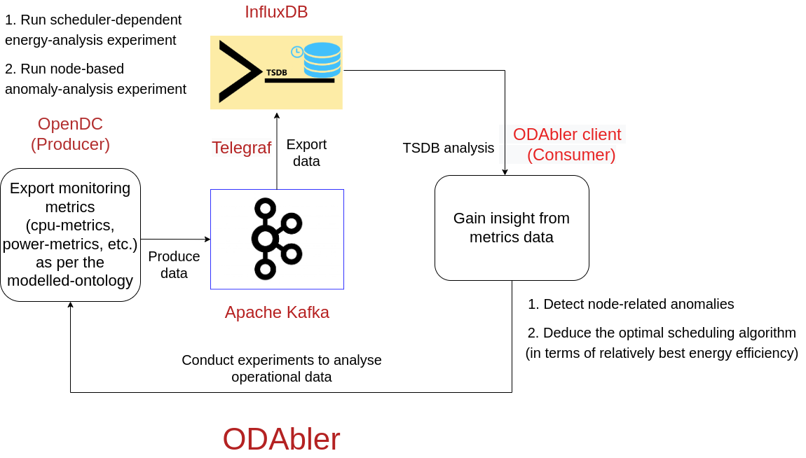

# ODAbler: an ODA (Operational Data Analytics) framework 

- This project generates operational data analytics insights for the [OpenDC](https://github.com/atlarge-research/opendc) simulator.
- The architecture of ODAbler is shown below:

#### Key technical components (shown in above screenshot) are briefly discussed below:
- **OpenDC**: OpenDC is a data centre simulation framework which allows various experimentation related to task-scheduling and others. This project's goal is to create a digital twin for OpenDC, showcasing the ODA capabilities using `ODAbler` on top of the OpenDC simulator (OpenDC - https://github.com/am-i-helpful/opendc.git).
- **Apache Kafka**: Apache Kafka is an open-source distributed event-streaming platform used by several organisations for high-performance data pipelines, streaming analytics, data integration, and mission-critical applications (Apache Kafka - https://kafka.apache.org/).
- **InfluxDB**: It is a time-series database built specifically for time-series data (InfluxDB - https://www.influxdata.com). Its key features include native SQL support, low-latency queries, superior data compression, single datastore support for all time-series data, openness and interoperability with data ecosystems, and unlimited cardinality.
- **Telegraf**}: It is an open-source plugin-driven server agent that is responsible for collecting and sending metrics and events from various databases, systems, and IoT sensors (Telegraf - https://www.influxdata.com/time-series-platform/telegraf/). It is written in Go and has no external dependencies due to its compilation into a single binary, which allows its easier execution on any system. It requires a very minimal memory footprint. There are 4 types of Telegraf plugins: input, process, aggregate and output. We use the input and output plugins in the Telegraf configuration, where the input plugin collects metrics from the Kafka system and the output plugin writes to the InfluxDB datastore.
- **ODAbler client (analyser) application**: Referring to the application corresponding to this repo, a pure Python-based analysis application, which is responsible for communicating with OpenDC to trigger the execution of energy-efficiency-analysis and node-anomaly-analysis related experiments (ODAbler analysis client - https://github.com/am-i-helpful/ODAbler.git). Once the experiments are executed in OpenDC, the data made available to InfluxDB is analysed in this ODAbler client application, meaningful plots are visualised and relevant data points indicate the result of the analysis. This ODA-related application is a novel contribution as part of this thesis project.

### For using the ODAbler client (analyser) application, please follow the below instructions:
- Checkout this repository to a location, and open in PyCharm IDE (preferably).
- The `main.py` file contains the main declaration, where one can decide whether to launch "energy-efficiency" analysis experiment or "node-anomaly" detection experiment. It is suggested to only launch one experiment at a time, following the architectural flow.  The default experimentation selected is the task scheduling algorithms' "energy-efficiency" analysis experiment.
- Make sure that Apache Kafka, and InfluxDB services are available and running on the system where the experiment is being conducted
- Once both Kafka and InfluxDB is running, then start Telegraf agent with the configuration available in the `key-configuration` directory, under the filename `telegraf.conf`. It should be copied to the configuration directory located at `/etc/telegraf/` on the system where the Telegraf service is to be started, such that Telegraf launches the service with expected results at the InfluxDB end.
- When all the pre-requisite services (Kafka, InfluxDB, and Telegraf) are running successfully, launch OpenDC socket server (`ODAExperimentListener`) such that it can accept connection request and experiment-related messages to kickstart the production of power and energy usage related metrics, which can be shipped to Kafka, and then to InfluxDB via Telegraf. This process might take some time (~2-5 minutes) depending on the experiment and the trace file executing at the moment.
- Please note that all sorts of configuration are automatically take care by OpenDC server itself. ODAbler only needs to send either the experiment-type, and then wait for the response from OpenDC about the final status of the corresponding experiment.
- Once the metrics data is available at InfluxDB, ODAbler client would start the analysis online (if there is no timeout).
🔴 **IMPORTANT - It is critical to note the time of starting the experiment**❗ (Flux uses UTC time standard to store the datetime; other time zones need to take care of the UTC conversion while querying in the on-demand mode of ODA analysis), as the same can be used later in Flux query for on-demand analysis (if needed). Otherwise, the options are to go through the InfluxDB "data explorer" and search for data points using the available filter, or install the InfluxDB tools (more detail can be found here - https://awesome.influxdata.com/docs/part-1/introduction-to-influxdb-tools/).  
- On-demand ODA analysis can always be done by triggering the analysis manually by invoking the `opendc_energy_experiment_runner.py` or `opendc_anomaly_experiment-runner.py` file inside the `opendc_experiment_runner` directory (and not using the `main.py` file).
- The runner modules call the already created template Python notebooks available inside the `opendc_experiment_analyser` directory, which has all desired notebooks ready for analysis within the respective experiment-named directory.  🔴 Another important piece of information is that the template notebooks available inside the `opendc_experiment_analyser` directory are currently configured to search for a specific time duration ❗(filtering on the start and stop time of the data available in InfluxDB, which is basically the timestamp of execution of the experiment; unless if the trace execution lasts longer writing a lot of data over a long range of time). More detail about time range can be read here - https://docs.influxdata.com/flux/v0/stdlib/universe/range/.
- 🔴 **MOST IMPORTANT**: These template Python notebooks located inside `opendc_experiment_analyser/*experiment_name*/*.ipynb` are copied to the `generated_notebooks` directory, and then executed for performing the desired ODA analysis. So, when the ODAbler has been setup for the first time, please make sure that the timestamp of the experiment execution is noted, converted to UTC format, and then required changes are done to ensure that the data is filtered and analysed suitably.
- Lastly, please go through the individual Python notebooks to understand the analysis done, as they are self explanatory and documented.

### Please use PyCharm IDE for setting up the `ODAbler` project and IntelliJ IDEA for the `OpenDC` project (if possible)
- These IDEs give the best performance and huge flexibility to conduct the experiment. That being said, other editors/IDEs like VSCode might work, but the author has not tested on them. 